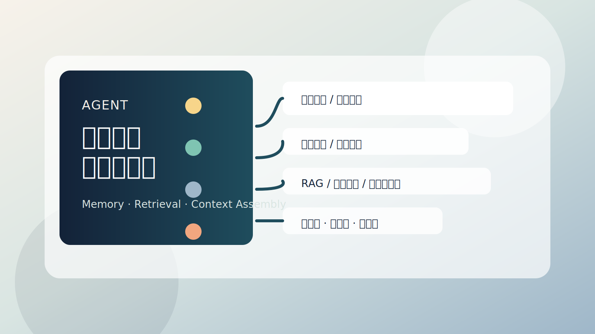

知识体系是 Agent 定义中的第一要素。它解决的不是“存更多”，而是**在正确时机拿到最相关的信息**，让 Agent 知道什么、理解什么，从而支撑持续决策。

如果把这个问题说得更直白一点，Agent 想要稳定完成任务，至少要回答四个问题：

1. 当前任务的状态是什么
2. 哪些历史信息值得继续保留
3. 外部知识应该从哪里取
4. 在有限上下文里，哪些信息最值得优先装进去

这也是为什么“知识体系”和“记忆系统”从来不是可有可无的外挂，而是 Agent 架构里的核心基础设施。



## 记忆系统解决什么问题

很多人最开始理解 Agent 记忆，都会把它等同于“保留聊天记录”。这当然有帮助，但只够解决很短期的上下文连续性问题，远远不够支撑一个真正可持续执行的 Agent。

如果只靠聊天历史，系统很快就会遇到这些限制：

- 长任务无法稳定断点续跑
- 跨会话的偏好和事实很难保留
- 大规模知识库无法按需检索
- 成本、延迟和相关性失去平衡

所以，Agent 的记忆必须从“聊天记录”升级为“状态 + 知识 + 装配策略”的系统工程。

## 短期记忆与长期记忆

记忆系统至少要区分两层：

**短期记忆**，服务当前执行：

- 当前目标和子任务进度
- 最近几步工具调用结果
- 临时约束、变量和中间结论
- 当前会话里的上下文窗口

**长期记忆**，服务跨任务复用：

- 用户偏好
- 历史决策
- 业务知识
- 领域术语和稳定规则

这里最关键的设计原则不是“分层听起来更专业”，而是**两层记忆必须分离**。  
短期记忆本来就是高频变化、任务导向的；长期记忆应该保留稳定、可复用的信息。两者一旦混在一起，后续的检索、治理和维护成本都会迅速失控。

## 多级存储：热数据要小，冷数据要能找

一个更稳定的做法，是把记忆系统做成多级存储，而不是把所有信息都塞进一个向量库或一段超长 prompt。

| 层级 | 内容 | 特点 |
| --- | --- | --- |
| L0 热上下文 | 当前 prompt 直接携带的信息 | 最快、最贵 |
| L1 规则摘要 | 系统规则、用户约束、任务摘要 | 小而稳定 |
| L2 能力目录 | 工具说明、能力边界、可用资源 | 便于路由和规划 |
| L3 知识库 | 文档、事实、案例、结构化知识 | 主要检索层 |
| L4 冷历史 | 低频历史、归档记录、旧会话 | 默认不加载 |

这里真正的目标不是机械地给信息分层，而是满足三个工程要求：

- 热数据尽量小
- 冷数据随时可找
- 历史信息可追溯

只有这样，Agent 才能既保持执行速度，又不丢掉长期能力。

## 多级索引：不只是“语义最像”

很多团队谈记忆系统时，只盯着向量检索。但真实场景里，语义相近并不等于最该优先返回。

一个成熟的记忆系统通常至少要同时拥有四类索引：

- **结构索引**：按路径、实体、用户、项目、任务等确定性结构组织
- **语义索引**：按 embedding 支持相似语义召回
- **时序索引**：按新鲜度和时间顺序排序，避免旧知识污染当前判断
- **策略索引**：按权限、强制级别、可信度、保密等级过滤

为什么要这么设计？因为高价值信息往往不是“语义最像”的那条，而可能是：

- 最新的规则
- 权威级别最高的事实
- 当前用户有权限访问的版本

只靠语义检索，通常支撑不了生产级 Agent。

## 上下文装配不是拼接，而是一条流水线

上下文装配的本质，不是把“能找到的都塞进去”，而是在 token 预算内做动态取舍。

更合理的流程通常是：

```text
意图识别
  ↓
召回候选
  ↓
重排（相关性 / 权威性 / 新鲜度）
  ↓
预算裁剪（trim / summarize / compaction）
  ↓
执行中二次检索
```

这里有三个重要判断：

- 默认只加载最小必要热上下文
- 大块知识通过索引解引用，而不是预先全部塞进 prompt
- 长任务允许边执行边补检索，而不是一次规划到底

这决定了 Agent 是“看起来很聪明”，还是“真的能在复杂任务里持续运转”。

## RAG 的角色：让生成建立在检索之上

RAG 解决的核心问题不是“让模型知道更多”，而是**让模型在生成前拿到更相关、更可信的外部知识**。

大模型擅长泛化和推理，但在这些场景里天然不够：

- 私有知识不在训练语料里
- 事实会变化，参数无法实时更新
- 需要引用权威来源，而不是“像是对的”
- 需要控制 hallucination 风险

一个标准的 RAG 链路通常是：

```text
用户问题
  ↓
查询改写
  ↓
知识召回
  ↓
重排
  ↓
上下文装配
  ↓
生成回答 / 触发工具
```

不同知识源也不一样，可能来自：

- 文档知识库
- FAQ / Wiki
- 结构化数据库
- API 返回结果
- 代码库
- 历史工单、会话、日志

所以 RAG 真正的工程价值不在“向量库”这一个词，而在于它把检索和生成接起来，让模型的输出尽量建立在可追溯知识之上。

## 何时该用 RAG，何时不能只靠 RAG

RAG 很适合这些场景：

- 需要访问私有知识
- 需要引用最新事实
- 需要结果可追溯
- 需要与业务知识库耦合

但也有一些事情不应该只靠 RAG：

- 需要强事务和精确计算
- 需要严格一致性的结构化查询
- 需要复杂长链决策和副作用控制

这类场景更合理的分工通常是：

- RAG 负责取知识
- 工具 / 工作流负责执行
- 数据库负责确定性存储与计算

也就是说，RAG 不是万能的执行系统，而是 Agent 的知识供应层。

## 在架构里，知识层和 Agent 层怎么分工

从架构视角看，知识体系通常应该作为独立层存在：

- **Agent 层**：理解意图、拆任务、编排流程，调用业务系统 API，并在需要时调用知识工具
- **知识 / RAG 层**：管理文档、索引、检索和带引用回答，不把事务逻辑塞进模型里

一句话概括：

- Agent 负责“怎么调用、先调谁、怎么合成”
- 知识层负责“从企业资料里检索并给出可引用答案”

这一层边界非常重要。  
如果在 Agent 层自己再叠一套半成品 RAG，系统很容易出现职责重叠、难以治理、效果难以评估的问题。

## 最后一层难点，其实是治理

真正把记忆系统放进生产环境后，最难的往往不是召回，而是治理。

比如：

- 什么信息允许写入长期记忆
- 谁可以写入
- 写入前是否需要摘要、脱敏或去重
- 同一事实出现多个版本时如何合并
- 如何区分新信息与错误信息
- 是否保留版本历史和来源
- 如何做 TTL、归档、冷热迁移
- 如何做权限过滤、敏感内容隔离和可追溯审计

很多 Agent 系统不是死在“模型不够强”，而是死在“记忆越来越脏，检索越来越乱，最后没人敢信”。

## 结语

好的 Agent 知识体系，不是把更多历史塞进上下文，而是让：

- 状态可恢复
- 记忆可演化
- 知识可按需装配
- 检索可信且可追溯

如果把 Agent 看成一个持续决策系统，那么知识体系与记忆系统，决定的就是它凭什么在下一次任务里仍然做出像样的判断。
